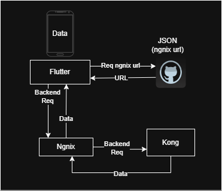
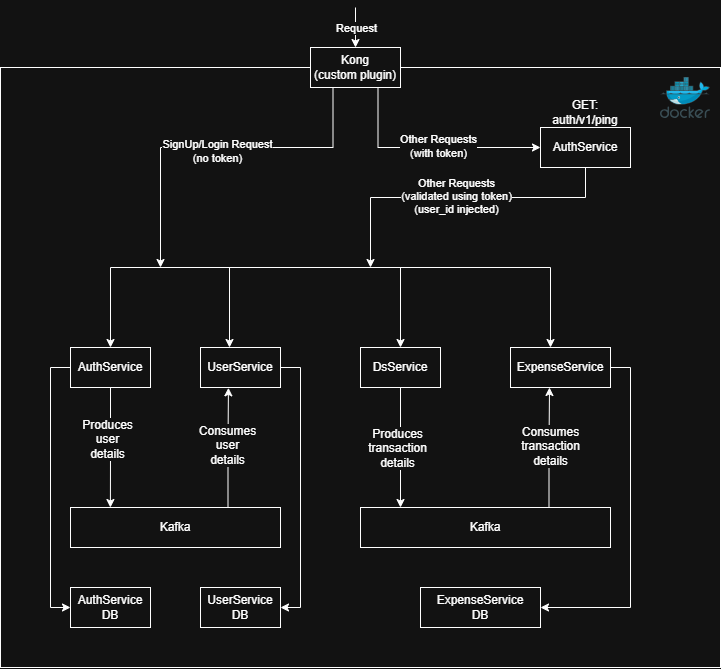
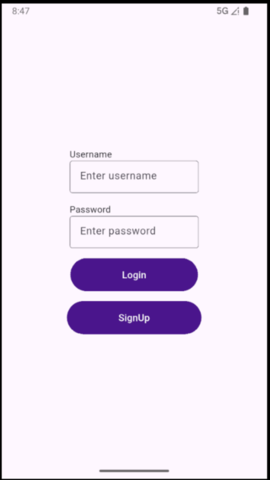
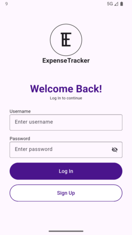
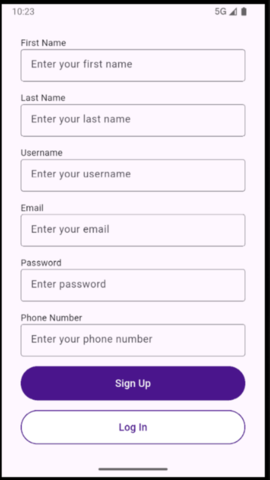
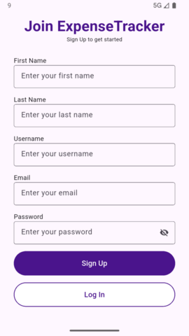
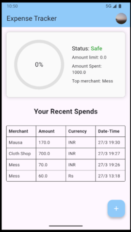
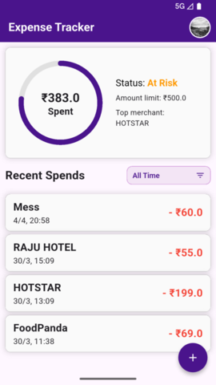
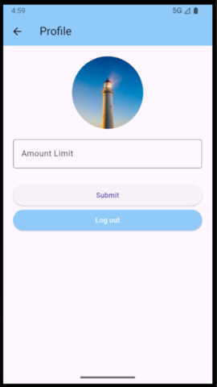
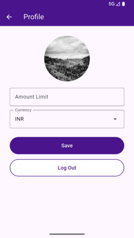

# Expense Tracker – Microservices Architecture with Kong & Kafka

## Overview

This project is a microservices-based expense management system built using Docker and orchestrated behind a Kong API Gateway. The system uses token-based authentication, Kafka for inter-service communication, and a custom Kong plugin for request validation and user context propagation.

The architecture is designed to be scalable, modular, and loosely coupled, with each service handling a specific responsibility.

## Watch Demo Video

[Download demo video](https://raw.githubusercontent.com/Sarthaksource/expense-tracker-microservices/main/ExpenseTrackerResources/demo.mp4)

## High-Level Architecture (HLD)

This diagram illustrates:
- Kong Gateway as the entry point
- Fetching url from github
- Use of Ngnix

## Backend Flow Diagram

This diagram shows:
- Authentication flow
- Request routing via Kong
- Header injection (X-User-Id)
- Service-to-service interactions
- Kafka producer/consumer flow

## System Components

### Kong API Gateway
- Acts as the single entry point for all client requests
- Uses a custom plugin to:
  - Extract `Authorization` header (`Bearer accessToken`)
  - Validate token via Auth Service
  - Inject `X-User-Id` into headers
  - Forward request to appropriate service

### Auth Service
Handles authentication and token management.

Endpoints:
- `login`  
  Accepts username and password  
  Returns accessToken, refreshToken, userId  

- `signup`  
  Accepts user data  
  Returns accessToken, refreshToken, userId  

- `ping`  
  Validates accessToken  
  Returns boolean (true if valid)  

- `refreshToken`  
  Generates new accessToken and refreshToken  

Kafka:
- Produces user data events consumed by User Service  

### User Service
Handles user-related data operations.

Endpoints:
- `createUpdate`  
  Creates or updates user profile  

- `getUser`  
  Retrieves user details  

Consumes:
- User data from Kafka (produced by Auth Service)

### Expense Service
Handles all expense-related operations.

All endpoints expect `X-User-Id` injected by Kong.

Endpoints:
- `getExpense`  
  Returns user expenses  

- `addExpense`  
  Adds a new expense  

- `addExpenseInfo`  
  Stores user-specific settings (limit, currency)  

- `getExpenseInfo`  
  Retrieves user-specific settings  

### DS Service (DataScience Service)
Processes messages and extracts structured transaction data.

Endpoint:
- `message`  
  Input: message + datetime  
  Process:
  - Extract transaction details using regex  
  - Inject userId from header  
  - Produce structured data to Kafka  

Kafka:
- Produces processed transaction data for Expense Service  

## Request Flow

### Authentication Flow
1. Client sends request with `Authorization: Bearer accessToken`
2. Kong plugin extracts token
3. Token is validated via Auth Service
4. If valid:
   - Auth Service returns userId
   - Kong injects `X-User-Id` into request
5. Request is forwarded to target service

### Expense Flow Example
1. Client sends request to add expense
2. Kong validates token
3. Kong injects `X-User-Id`
4. Request reaches Expense Service
5. Expense is stored against userId

### Kafka Flow
- Auth Service → produces user events → User Service consumes
- DS Service → produces transaction data → Expense Service consumes

## Frontend Screens

### Login Page

<table width="100%">
  <tr>
    <td align="center">
       
      Old Login Page UI
    </td>
    <td align="center" style="vertical-align: middle; font-size: 28px; width: 50px;">
      →
    </td>
    <td align="center">
       
      Improved Login Page UI
    </td>
  </tr>
</table>

### Signup Page

<table width="100%">
  <tr>
    <td align="center">
       
      Old Signup Page UI
    </td>
    <td align="center" style="vertical-align: middle; font-size: 28px; width: 50px;">
      →
    </td>
    <td align="center">
       
      Improved Signup Page UI
    </td>
  </tr>
</table>

### Home Page

<table width="100%">
  <tr>
    <td align="center">
       
      Old Home Page UI
    </td>
    <td align="center" style="vertical-align: middle; font-size: 28px; width: 50px;">
      →
    </td>
    <td align="center">
       
      Improved Home Page UI
    </td>
  </tr>
</table>

### Profile Page

<table width="100%">
  <tr>
    <td align="center">
       
      Old Profile Page UI
    </td>
    <td align="center" style="vertical-align: middle; font-size: 28px; width: 50px;">
      →
    </td>
    <td align="center">
       
      Improved Profile Page UI
    </td>
  </tr>
</table>

## Deployment

- All services are containerized using Docker
- Kong Gateway is configured as the API gateway
- Kafka is used for asynchronous communication
- Services communicate via internal Docker network

## Key Design Points

- Centralized authentication via Kong plugin
- Stateless services with token-based auth
- Loose coupling using Kafka
- Header-based user context propagation
- Clear separation of concerns across services

## Issues

Following issues need to be fixed:
- Getting expense from messages seems broken (misses some messages, refer demo video) ✅
- Allow user to turn on/off message permission ✅
- No way to change profile picture ✅
- Some fields in signup are redundant (username & email, also phone number which is commented)

## Notes

- All protected routes require a valid accessToken
- `X-User-Id` should never be set manually by clients
- Token lifecycle is managed entirely by Auth Service
- Kong plugin is critical for request validation and routing